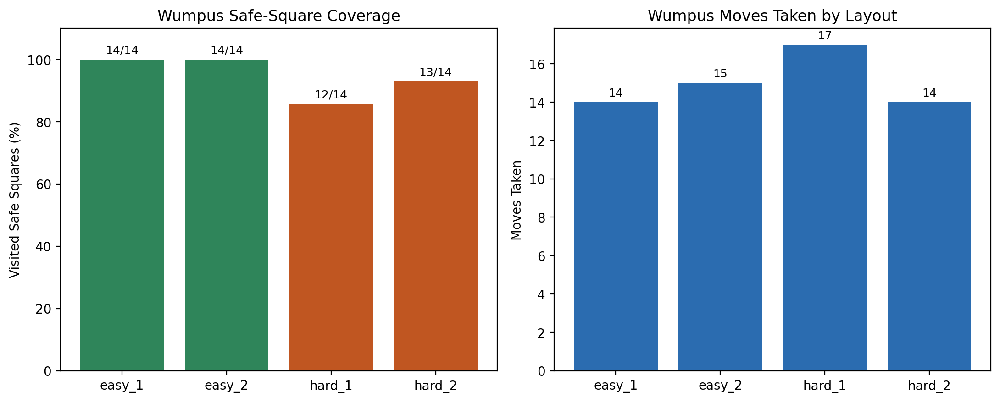
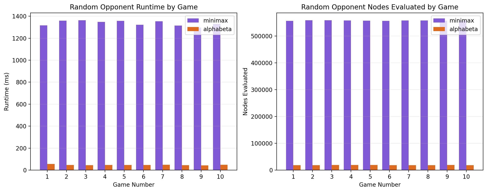

# CS 326 Project 4 Report

Jake Terry

## Overview

This project implements two separate AI systems:

- a Wumpus World agent that uses a knowledge base and explicit inference rules
- a Tic-Tac-Toe agent that uses adversarial search

I used Option B for this project. The codebase is split into two modules:

- `wumpus-world/` for the knowledge-based agent
- `tic-tac-toe/` for the adversarial search agent

The submission includes source code, tests, predefined Wumpus layouts, Tic-Tac-Toe opponent modes, and JSON outputs for the required runs.

## Wumpus World Representation

The Wumpus World implementation models a fixed 4x4 grid with:

- a single start square
- hidden pits
- exactly one Wumpus
- deterministic percepts for `breeze` and `stench`

The environment logic is separated from the reasoning logic:

- `environment.py` generates percepts from the layout
- `layouts.py` stores the four required instances
- `knowledge_base.py` stores facts and applies inference rules
- `agent.py` uses the current knowledge state to choose safe moves

### Knowledge Base Behavior

The knowledge base tracks:

- visited squares
- safe squares
- known pits
- the known Wumpus location when it can be inferred
- possible pit and Wumpus locations
- no-pit and no-Wumpus facts
- stored percepts

The main inference rules implemented are:

- if a square has no breeze, all adjacent squares are marked `no pit`
- if a square has no stench, all adjacent squares are marked `no wumpus`
- if a breezy square has only one remaining pit candidate, that square is marked as a pit
- if a stenchy square has only one remaining Wumpus candidate, that square is marked as the Wumpus
- if multiple stench constraints intersect in a single square, that square is marked as the Wumpus

The agent only moves into squares that the KB has proved safe. If no additional safe square can be proved, the agent stops instead of guessing. This behavior satisfies the project requirement that the agent avoid moving into squares known to be unsafe.

## Tic-Tac-Toe Implementation

The Tic-Tac-Toe module supports:

- a 3x3 board
- alternating turns
- legal move generation
- terminal tests for win, loss, and draw
- terminal utility values `+1`, `0`, and `-1`

The search implementation includes:

- `MinimaxAgent`
- `AlphaBetaAgent`

The agent always plays as `X`, and the opponent plays as `O`. Two opponent modes are included:

- `random`
- `scripted`

The scripted opponent gives a deterministic second required comparison mode without needing live human input.

## Testing Summary

Both modules include focused correctness tests.

### Wumpus World tests

The Wumpus tests check:

- percept generation
- knowledge base updates after each percept
- hazard inference from overlapping clues
- that the agent never enters a square already known to be unsafe
- that the agent fully explores an easy layout

### Tic-Tac-Toe tests

The Tic-Tac-Toe tests check:

- legal move generation
- terminal-state recognition
- utility values on terminal boards
- that Minimax chooses a utility-maximizing move
- that Alpha-Beta matches Minimax while evaluating no more nodes

Both test suites passed locally:

- `wumpus-world/src`: `5 passed`
- `tic-tac-toe/src`: `5 passed`

## Experimental Setup

### Wumpus World runs

The required four layouts were used:

- `easy_1`
- `easy_2`
- `hard_1`
- `hard_2`

All four were run with the `kb` configuration.

The two easy layouts were chosen so the agent gets useful `no breeze` and `no stench` information almost immediately. That matters because a negative percept is strong evidence: it allows the KB to mark all adjacent squares as free of that hazard. In `easy_1` and `easy_2`, the hazards are placed far enough from the start that the agent can prove many nearby squares safe early in the run, which makes exploration straightforward.

The two hard layouts were chosen for the opposite reason. In `hard_1` and `hard_2`, the hazards create breezes and stenches earlier and in more overlapping areas of the board. A positive percept is weaker than a negative one because it only says that at least one adjacent square may contain a hazard, not which one. That leaves multiple candidates in play at the same time, so the agent has to combine information from several visited squares before it can narrow anything down. These layouts are therefore harder because they preserve uncertainty longer, not because they increase the board size.

### Tic-Tac-Toe runs

The required minimum runs were completed:

- 10 games against the random opponent using `minimax`
- 5 games against the scripted opponent using `minimax`

Because Alpha-Beta pruning was also implemented, additional comparison runs were included:

- 10 games against the random opponent using `alphabeta`
- 5 games against the scripted opponent using `alphabeta`

## Results

### Wumpus World

| Instance | Config | Success | Runtime (ms) | States Expanded | Moves Taken | Visited Safe Squares |
| -------- | ------ | ------- | -----------: | --------------: | ----------: | -------------------- |
| easy_1   | kb     | true    |        2.086 |              14 |          14 | 14/14                |
| easy_2   | kb     | true    |        2.687 |              14 |          15 | 14/14                |
| hard_1   | kb     | false   |        2.173 |              12 |          17 | 12/14                |
| hard_2   | kb     | false   |        1.695 |              13 |          14 | 13/14                |

Summary:

- the agent fully solved both easy layouts
- the agent did not fully solve either hard layout
- both failures ended because no additional square could be proved safe, not because the agent stepped into a known hazard



Written comparison:

The Wumpus results separate cleanly into the easy and hard layouts. In `easy_1` and `easy_2`, the agent successfully explored all `14/14` safe squares. In `hard_1` and `hard_2`, the agent explored `12/14` and `13/14` safe squares, respectively, before stopping.

The important result is that both hard-layout runs ended safely. The agent did not fail by entering a pit or the Wumpus. Instead, it stopped because the current knowledge base could not prove any remaining unvisited square was safe. This shows that the agent’s behavior is conservative: it prefers stopping over making an unjustified move.

Runtime stayed low in all four runs because the world is only `4x4`, so the more meaningful differences are exploration coverage and success status. The easy layouts allowed full exploration, while the hard layouts preserved enough uncertainty to prevent complete completion under the current inference rules.

### Tic-Tac-Toe

| Opponent | Config    | Games | Wins | Draws | Losses | Avg Runtime (ms) | Avg Nodes Evaluated |
| -------- | --------- | ----: | ---: | ----: | -----: | ---------------: | ------------------: |
| random   | minimax   |    10 |   10 |     0 |      0 |         1335.730 |            557535.6 |
| random   | alphabeta |    10 |   10 |     0 |      0 |           47.958 |             18915.3 |
| scripted | minimax   |     5 |    5 |     0 |      0 |         1346.913 |            557487.0 |
| scripted | alphabeta |     5 |    5 |     0 |      0 |           47.225 |             19213.0 |

Summary:

- both search configurations won every recorded game
- Alpha-Beta preserved move quality while reducing runtime dramatically
- Alpha-Beta also reduced node evaluation from roughly 557k nodes to about 19k nodes per game



Written comparison:

The Tic-Tac-Toe results were consistent across both opponent types. Against the random opponent, both `minimax` and `alphabeta` won all 10 games, which is what should happen when a perfect-information search agent plays from the initial board against a non-optimal opponent. Against the scripted deterministic opponent, both configurations again won every game, showing that the search logic remained correct under a repeatable adversarial pattern.

Because win/loss/draw outcomes were identical, runtime and node counts become the meaningful comparison metrics. Plain Minimax evaluated about `557k` nodes per game in both opponent settings, while Alpha-Beta reduced that to about `19k` nodes per game. That means pruning removed the majority of the search tree without changing the final move chosen. The runtime reduction follows the same pattern: roughly `1.3` seconds per game for Minimax versus about `48` milliseconds for Alpha-Beta.

Moves taken also help interpret the results. Some wins ended in 5 moves and others in 7, depending on how quickly the opponent allowed a winning line to appear. The fact that both search configurations produced the same outcomes with the same quality of decisions, but very different search costs, is strong evidence that Alpha-Beta is functioning as an optimization of Minimax rather than a different policy.

## Analysis

### How the Wumpus agent infers safe and unsafe squares

The Wumpus agent starts with the percepts it gets from visited squares. If a square has no breeze, then all adjacent squares are treated as having no pit. If a square has no stench, then all adjacent squares are treated as having no Wumpus. Those two rules are the main reason the agent can expand safely on the easier layouts.

Positive percepts work differently. A breeze does not tell the agent exactly where a pit is. It only says that at least one adjacent square may contain one. A stench works the same way for the Wumpus. The KB keeps narrowing those possibilities as more percepts come in. When only one candidate is left, that square becomes a known pit or the known Wumpus.

This is why the agent is conservative. It only moves into squares the KB can justify as safe. If a square is still unknown, the agent does not treat it as safe just because nothing bad has happened yet. That is also why the hard layouts can stop early. The agent is not broken in those runs. It is refusing to guess.

### Concrete Wumpus inference example

The clearest example appears in `wumpus_hard_2_kb.json`.

At step 2, when the agent visits `(0, 2)`, it gets `breeze = true` and `stench = false`. That means there is no Wumpus next to `(0, 2)`, but there may be a pit in one of the adjacent squares. At that point the main pit candidates are `(0, 3)` and `(1, 2)`.

At step 4, when the agent visits `(1, 1)`, it perceives both a breeze and a stench. After combining that new information with earlier `no stench` facts, the KB resolves:

- `known_pits = [(1, 2)]`
- `known_wumpus = (2, 1)`

This is a good example because the agent did not get those answers directly from the environment. It figured them out by combining multiple clues from different squares. That is the main point of the Wumpus part of the project.

The same trace also shows how one new fact can help with more than one square. Once the KB is confident about `(1, 2)` and `(2, 1)`, it can rule those hazards out of other nearby decisions and update more squares as safe or unsafe.

### Why Minimax chooses the move it does

A clear example appears in `tictactoe_scripted_minimax.json`.

By step 5, the board is:

```text
X X O
_ O _
X _ O
```

It is `X`'s turn. Minimax chooses `(1, 0)`, producing:

```text
X X O
X O _
X _ O
```

This immediately completes the first column and ends the game with a win for `X`. The recorded search result for that move has `score = 1`, which matches the terminal utility definition for a forced win.

This example shows the core Minimax idea clearly. The agent is not hoping the opponent makes a mistake. It checks the possible replies and chooses the move that still gives the best outcome under the worst response. In this case, `(1, 0)` wins immediately, so it is the strongest possible move.

After the tie-break change, the implementation also prefers the immediate win over a move that would still win later. That does not change Minimax correctness, but it makes the move choice cleaner and easier to explain.

### Alpha-Beta pruning comparison

The Alpha-Beta implementation gives the same results as Minimax on the recorded runs, but it does much less search work.

For the random-opponent experiment:

- Minimax average nodes evaluated: `557535.6`
- Alpha-Beta average nodes evaluated: `18915.3`

For the scripted-opponent experiment:

- Minimax average nodes evaluated: `557487.0`
- Alpha-Beta average nodes evaluated: `19213.0`

The same pattern shows up in runtime:

- random opponent: `1335.730 ms` for Minimax vs `47.958 ms` for Alpha-Beta
- scripted opponent: `1346.913 ms` for Minimax vs `47.225 ms` for Alpha-Beta

The reason is simple: Alpha-Beta stops exploring a branch once it knows that branch cannot improve the final decision. Minimax still reaches the correct answer, but it keeps checking many branches that do not matter anymore. Alpha-Beta cuts those off early.

That is why the reduction is so large even in a small game like Tic-Tac-Toe. Both algorithms make the same decisions, but Alpha-Beta gets there much faster. That is exactly what the pruning comparison was supposed to show.

## Validation and Sanity Checks

Because this submission uses Option B, validation mattered as much as implementation.

The main validation steps were:

- writing focused unit tests for both modules
- checking that Alpha-Beta never returned a different move or score than Minimax on the same board
- verifying that the Wumpus agent never entered squares already known to be unsafe
- checking that all required JSON files were generated and contained the required fields
- reviewing traces to confirm that the Wumpus KB and Tic-Tac-Toe search decisions were reasonable

I also checked the overall behavior:

- easy Wumpus layouts should usually be fully explored
- harder Wumpus layouts may stop early because the agent refuses to guess
- perfect-information Tic-Tac-Toe search should never lose from the starting position
- Alpha-Beta should evaluate fewer nodes than plain Minimax

The recorded outputs matched all of those expectations.

## Files Included

The submission package contains:

- Python source code
- per-module README files with run instructions
- predefined Wumpus layouts
- Tic-Tac-Toe opponent modes and tests
- JSON output files for the required runs
- this report draft

## AI Disclosure Appendix

This project is being submitted under Option B.

### AI tools used

- OpenAI Codex

### What the tool was used for

AI was used as a development assistant throughout the project. The main uses were:

- scaffolding the initial structure for the `wumpus-world` and `tic-tac-toe` modules
- generating and refining Python code for the Wumpus environment, knowledge base, reasoning agent, Tic-Tac-Toe game state, Minimax search, and Alpha-Beta pruning
- helping implement CLI runners and JSON output generation
- helping write and revise unit tests
- answering design and debugging questions during development
- helping draft and refine parts of the report and submission checklist

AI was not treated as a substitute for validation. All code was reviewed, edited, run, and tested locally before being kept in the final submission.

### Example prompts

Representative prompts used during development included:

1. Wumpus World implementation prompt:

```text
Wumpus World:

Rules:
If there is no breeze in a square, then adjacent squares contain no pits.
If there is no stench in a square, then adjacent squares contain no Wumpus.
If there is a breeze, then at least one adjacent square may contain a pit.
If there is a stench, then at least one adjacent square may contain the Wumpus.

Representation:
The Wumpus World environment must support:
A grid world (4x4)
A starting square.
Hidden pits.
One Wumpus.
Percepts such as Breeze and Stench.

Architecture:
- layouts.py (predefined board states, start, pits, wumpus)
- environment.py (grid world and percept generation)
- knowledge_base.py (explicit facts and inference rules)
- agent.py (knowledge-based agent loop)

Output:
- print results to the terminal
- save results to a JSON file with:
  - problem
  - instance
  - config
  - success
  - runtime_ms
  - states_expanded
  - moves_taken
  - trace
```
2. Tic-Tac-Toe implementation prompt:

```text
Tic-Tac-Toe:

Rules:
The game must support a 3x3 board.
Players alternate turns.
The game must detect win, loss, and draw terminal states.
Utility values should be:
Win = +1
Draw = 0
Loss = -1

Search:
Implement Minimax correctly.
Implement Alpha-Beta pruning as an additional comparison configuration.
Minimax assumes the opponent plays optimally.
The maximizing player should choose the move that maximizes payoff under the worst opponent response.

Representation:
The Tic-Tac-Toe module must support:
A 3x3 board
Alternating turns
Terminal tests
A utility function

Architecture:
- game.py (board representation, legal moves, terminal tests, utility)
- minimax.py (Minimax and Alpha-Beta search)
- opponents.py (random and scripted opponents)
- run_tictactoe.py (CLI runner and JSON output)

Output:
- print results to the terminal
- save results to a JSON file with:
  - problem
  - instance
  - config
  - result
  - runtime_ms
  - nodes_evaluated
  - moves_taken
  - trace
```
3. Wumpus World testing prompt:

```text
Test Wumpus World on:

- test_environment_generates_expected_percepts
- test_knowledge_base_updates_after_each_percept
- test_kb_can_isolate_hazards_from_overlapping_clues
- test_agent_never_moves_into_square_already_known_unsafe
- test_agent_fully_explores_easy_layout

```
4. Tic-Tac-Toe testing prompt:

```text
Test Tic-Tac-Toe on:

- test_legal_moves_generated_correctly
- test_terminal_states_recognized_correctly
- test_minimax_chooses_utility_maximizing_move
- test_minimax_prefers_immediate_win_when_multiple_wins_exist
- test_alphabeta_matches_minimax_and_evaluates_no_more_nodes

```
5. Minimax tie-break refinement prompt:

```text
Minimax should prefer the immediate win here instead of a move that only eventually wins. Show the change.

Reason for the prompt:
In one recorded run, the JSON trace showed that Minimax selected a move that still led to a win, but did not end the game as early as possible.

JSON example pasted during development:
"problem": "tictactoe",
"instance": "random",
"config": "minimax",
"result": "win",
"runtime_ms": 1291.132,
"nodes_evaluated": 558331,
"moves_taken": 7,
"trace": [
  {
    "step": 0,
    "actor": "minimax",
    "player": "X",
    "move": [0, 0],
    "board": [
      ["X", " ", " "],
      [" ", " ", " "],
      [" ", " ", " "]
    ],
    "nodes_evaluated": 549946,
    "score": 0
  },
  {
    "step": 1,
    "actor": "random",
    "player": "O",
    "move": [0, 1],
    "board": [
      ["X", "O", " "],
      [" ", " ", " "],
      [" ", " ", " "]
    ],
    "nodes_evaluated": null,
    "score": null
  },
  {
    "step": 2,
    "actor": "minimax",
    "player": "X",
    "move": [1, 0],
    "board": [
      ["X", "O", " "],
      ["X", " ", " "],
      [" ", " ", " "]
    ],
    "nodes_evaluated": 8232,
    "score": 1
  },
  {
    "step": 3,
    "actor": "random",
    "player": "O",
    "move": [0, 2],
    "board": [
      ["X", "O", "O"],
      ["X", " ", " "],
      [" ", " ", " "]
    ],
    "nodes_evaluated": null,
    "score": null
  },
  {
    "step": 4,
    "actor": "minimax",
    "player": "X",
    "move": [1, 1],
    "board": [
      ["X", "O", "O"],
      ["X", "X", " "],
      [" ", " ", " "]
    ],
    "nodes_evaluated": 146,
    "score": 1
  },
  {
    "step": 5,
    "actor": "random",
    "player": "O",
    "move": [1, 2],
    "board": [
      ["X", "O", "O"],
      ["X", "X", "O"],
      [" ", " ", " "]
    ],
    "nodes_evaluated": null,
    "score": null
  },
  {
    "step": 6,
    "actor": "minimax",
    "player": "X",
    "move": [2, 0],
    "board": [
      ["X", "O", "O"],
      ["X", "X", "O"],
      ["X", " ", " "]
    ],
    "nodes_evaluated": 7,
    "score": 1
  }
],
"winner": "X",
"final_board": [
  ["X", "O", "O"],
  ["X", "X", "O"],
  ["X", " ", " "]
]

Expected behavior:
If an immediate winning move exists, Minimax should prefer that move over another move with the same eventual utility.
```

### How the code was verified

The code was verified through both automated tests and direct experiment runs.

Verification included:

- running the Wumpus World test suite to confirm percept generation, KB updates, hazard inference behavior, and unsafe-move avoidance
- running the Tic-Tac-Toe test suite to confirm legal move generation, terminal-state detection, utility calculation, Minimax move quality, and Alpha-Beta consistency with Minimax
- executing all four required Wumpus layouts and checking that terminal output and JSON output were produced
- executing the required Tic-Tac-Toe runs:
  - 10 games against a random opponent
  - 5 games against a scripted deterministic opponent
- executing additional Alpha-Beta comparison runs and confirming that pruning reduced node evaluations and runtime while preserving outcomes
- manually inspecting traces and result JSON files to verify that the Wumpus agent’s inferences and the Tic-Tac-Toe agent’s move choices were reasonable and matched the intended logic

Overall, all AI-assisted code that remained in the final project was manually reviewed and then validated with local tests, required experiment runs, and inspection of the generated traces and JSON outputs.
