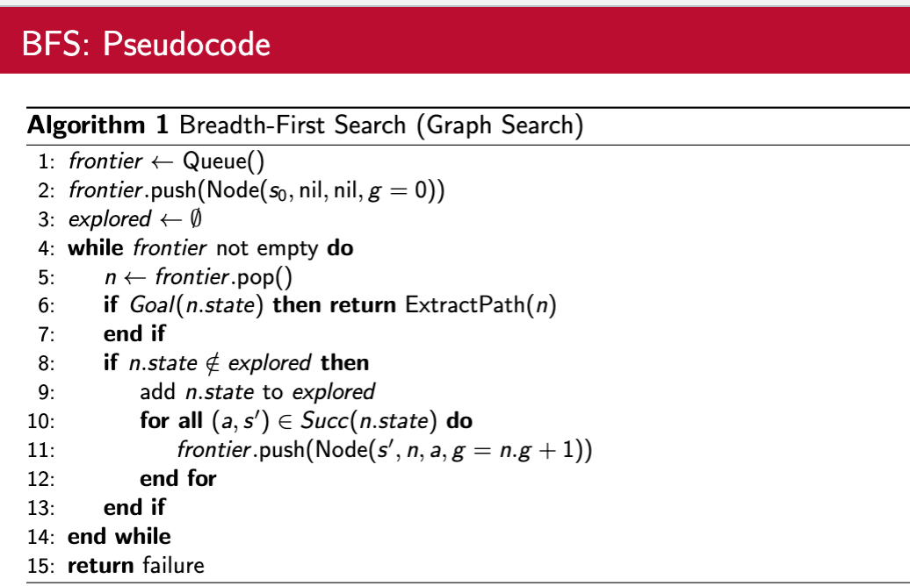
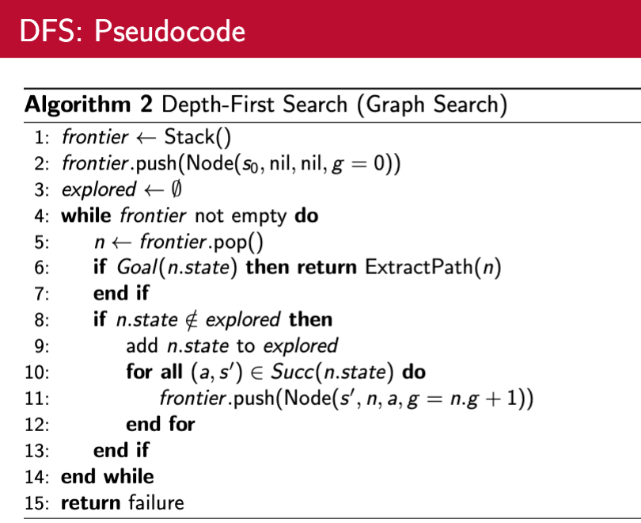
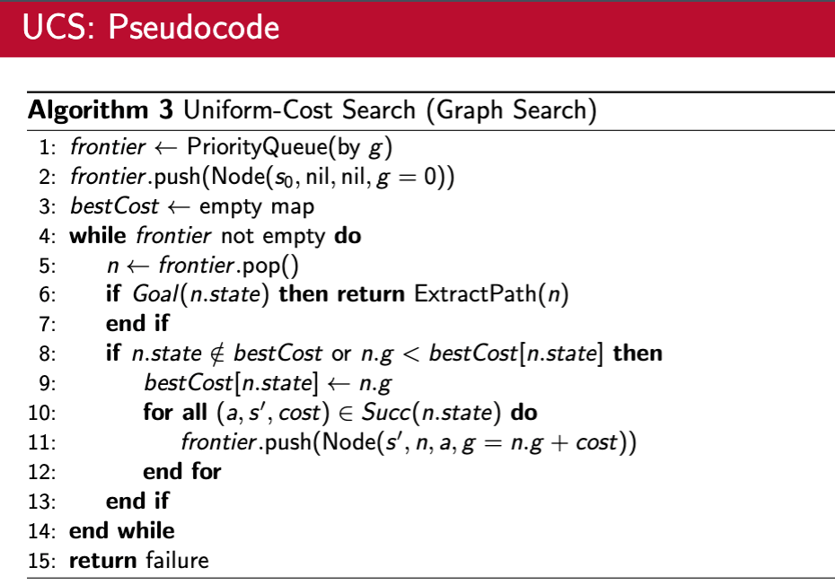
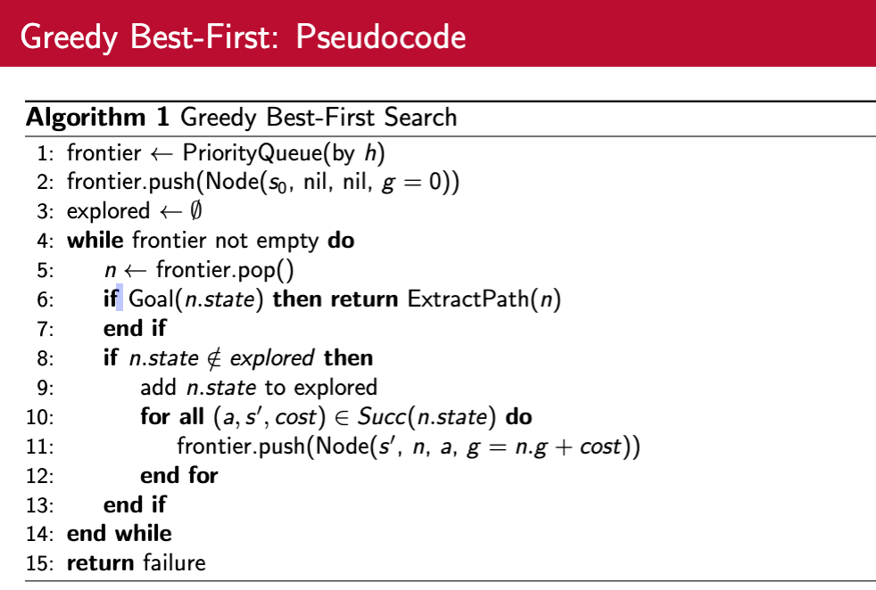
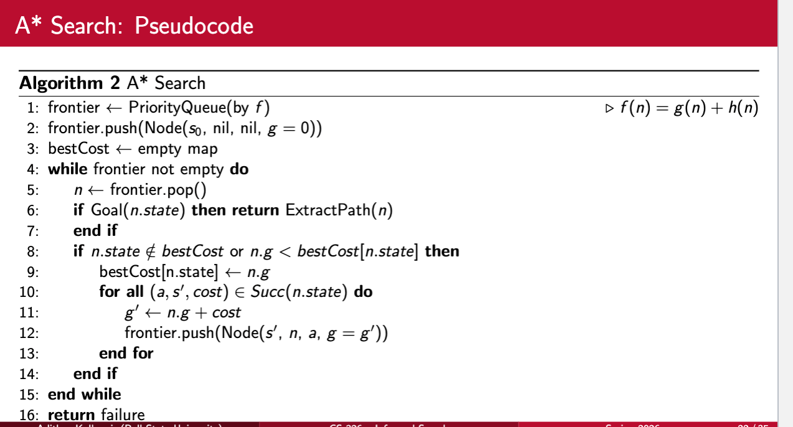
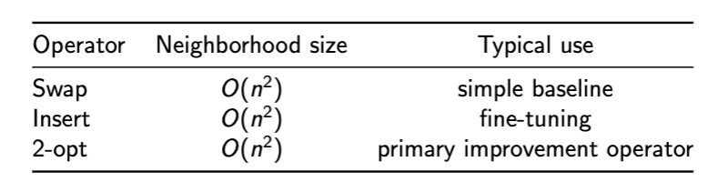
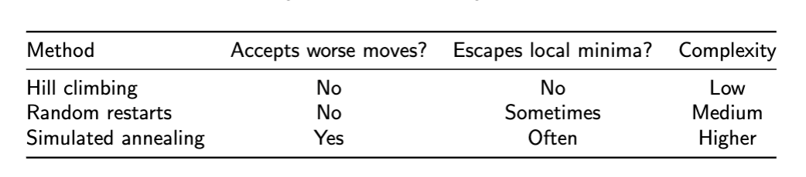
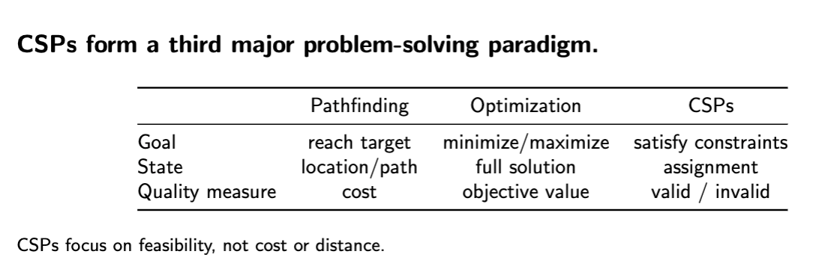
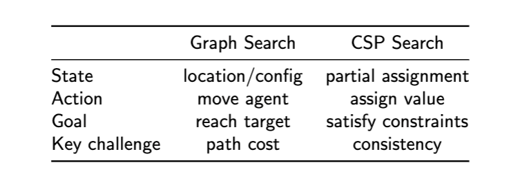

# Midterm

## Table of Contents 
- [Artificial Intelligence](#artificial-intelligence)
- [Search Algorithms](#search-algorithms)
    - [BFS](#bfs)
    - [DFS](#dfs)
    - [UCS](#ucs)
    - [Hueristic](#hueristic)
    - [A_Star](#a_star)
- [CSP](#csp)
    - [Variables](#variables)
    - [Domains](#domains)
    - [Constraints](#constraints)
- [Knowledge Representation and Logic](#knowledge-representation-and-logic)


### Artificial Intelligence
Artificial intelligence (AI) is the capability of computational systems to perform
tasks typically associated with human intelligence, such as learning, reasoning,
problem-solving, perception, and decision-making.


* **Perceive** their environment through sensors or input data
* **Reason** about that information using formal models
* **Make** decisions based on goals and preferences
* **Act** to achieve those goals in an effective and rational way

#### A short history: why paradigms changed:  
AI alternates between symbolic and statistical/learning paradigms.   

**Representation**
How knowledge is stored (rules? probabilities? neural nets?)

**Computation**
What we can realistically compute/search

**Evaluation**
How we measure intelligence and generalization
  
Definitions of AI: four viewpoints
Rational agents: performance + uncertainty

- Timeline:
    - 1950 Early optimization: Turing, Dartmouth
        * Can we test intelligent behavior
        * Intelligence can be described precisely enough to simulate
            * Reality: noisy env, combinatorial explosion, naive approach fails at scale
    - 1970 Symbolic AI: logic/rules
        * If-then rules, logic systems, ontologies
        * Narrow, structured domains
        * Rules explode combinatorially (scaling)
        * Brittle under ambiguity
    - 1980 Expert Systems: knowledge engineering
    - 2000 Statistical ML: data-driven
    - 2020 Deep + Generative: transformers/LLM
---
#### Four Definitions of AI  

|     | Human-based | Rational-Based |
|-----------|-------------|---|
| Thinking    | Cognitive Models     | Logic & inference |
| Acting | Turing Test  | Rational Agents |

AI definitions differ along two
dimensions: how intelligence is
measured (human vs. rational) and
how it is evaluated (thinking vs.
acting).  

CS 326 focuses on acting rationally.  

Rationality provides precise, testable
objectives for evaluating AI systems.  
---
#### What is an Agent?

Maps **percepts** to **actions** to optimize a **performance measure**.

Percepts:  
* Observability (full vs. partial)  
* Dynamics (static vs. dynamic)  
* Uncertainty (deterministic vs. stochastic)  
* Horizon (episodic vs. sequential)   

PEAS = problem specification tool

* Performance Measure

* Environment

* Actuators

* Sensors

Make AI problem statements precise.
---
#### Components of a Problem Formulation
1. Initial state
> The initial state specifies where the agent begins.
2. State space
> The state space is the set of all states reachable from the initial state via any sequence of actions.
3. Actions
> Actions specify the legal moves available to the agent in each state.
4. Transition model
> The transition model describes how actions transform one state into another.
5. Goal test
> A goal test determines whether a given state satisfies the problem’s objective.
6. Path cost
> The path cost assigns a numeric value to a sequence of actions, enabling comparison among multiple
solutions.
---
#### State Space vs Search Tree

State Space
 * The state space includes all possible states reachable from the initial state.

Search tree
 * The search tree represents the paths explored by a specific search algorithm.

--- 
### Search Algorithms

#### States, Edges, and Nodes: Two Related Graphs

State Space Graph (the problem): 

- Vertices = states: e.g., “agent is at city
B”
- Edges = actions: e.g., “drive from B to D”
- Edges may have costs (distance, time, tolls)

Search Tree (built by the algorithm):

- Tree nodes = paths to states
- A node stores: <mark>state, parent, action, depth,
path cost<mark>

---
#### What is a Node? 

A node represents a path to a state. A node stores:  
- Current state
- Parent node
- Action taken
- Depth (number of moves)

<mark>States define the problem; nodes define the search.<mark>

---
> BFS, DFS, and UCS share the same structure.
>
>- frontier: nodes discovered but not yet expanded
>
>- explored: set of states already expanded
>
>- goal test: checks whether a state satisfies the objective
>
>The algorithms differ only in <mark>how the frontier is ordered<mark>
---

#### BFS

Behavior: BFS explores the search space level by level.

Frontier ordering: **Queue** (FIFO)

| Pro | Con |
| --- | --- |
| Complete | High memory usage| 
| Optimal when cost equal | Not cost-optimal when costs differ |
| Simple and predictable | |

> Best Case when unweighted




<mark>BFS is complete and guarantees shortest solutions in terms of number of steps, but requires significant
memory.<mark>

---
#### DFS

Behavior: DFS explores one route as deeply as possible before backtracking.

Frontier Ordering: **Stack** (LIFO)


| Pro | Con |
| --- | --- |
| Low memory usage | Not Optimal | 
| Can reach deep solutions quickly |May fail to terminate infinite graphs |
| | Solution quality unpredictable |

>Best Case Deep Solutions with Limited Memory



<mark>DFS uses little memory but may explore deep, unproductive paths before finding a solution.<mark>

---
#### UCS

Behavior: UCS expands the path with the lowest total cost.

Frontier Ordering: **Priority Queue** by path cost *g(n)*


| Pro | Con |
| --- | --- |
| Complete (positive costs) | Higher overhead than BFS | 
| Optimal (lowest cost) | Exponential time and space in worst case |
| Correct for weighted graphs |  |

>Best Case route planning with different costs



<mark>Choose the route that is cheapest so far, regardless of number of steps.<mark>

--- 
### Hueristic

We reduce wasted search by using heuristic knowledge.

>UCS is optimal—but it explores too much.

A heuristic adds goal-directed knowledge to search.  

<mark>A heuristic function h(n) estimates the cost from state n to a goal.<mark>

Grid navigation:  
If the goal is at (rg , cg ) and the agent is at (r , c):

```h(n) = |r − rg | + |c − cg |```

---

#### Greedy Best-First Search

- Choose the node that looks closest to the goal.

Behavior: Ignore the cost so far; chase the goal.

Frontier Ordering: priority(n) = h(n)


>Greedy keeps decreasing h as quickly as possible.
>Greedy does not know whether a move is expensive. If costs vary, Greedy can produce a very high-cost
path even if it reaches the goal quickly.

| Pro | Con |
| --- | --- |
| Often explores far fewer states than UCS | Not optimal (can return expensive paths) | 
| Quickly reaches a goal in many problems | Can be misled by poor hueristics |

> Fast because it is aggressive; risky because it ignores g(n) [total cost]



---

#### A_Star

Behavior: Balance cost so far with estimated cost remaining.

Frontier Ordering: priority(f(n))

*f(n) = g(n) + h(n), where*

*g (n): cost already paid*

*h(n): estimated cost remaining*

> A* is UCS plus a heuristic.
>If h(n) never overestimates the true remaining cost, A* will not miss the optimal path.



<mark>Goal-directed and cost-aware if hueristics are admissible (never over-estimate)<mark>

--- 


### TSP


- Optimization vs Pathfinding

Searching for the best solution when every state is a complete solution.

Exact optimality is often less important than getting a very good solution quickly. Local search explores complete solutions, not partial paths.

Graph search mindset: 
- States = partial solutions
- Goal test = reach target state

Local search mindset
- States = complete tours
- Goal = minimize cost

**What Is Local Search?**
- Improve a solution by making small changes.
- Start with a complete solution and repeatedly move to a nearby solution that is better.
- No frontier, no explored set, no explicit goal state.

1. Generate an initial solution
2. Generate neighboring solutions
3. Choose the next solution
4. Repeat until termination

>At every step, the algorithm holds one current solution.

**State Representation for TSP**

- A state is a permutation of cities.
- A tour is an ordered list [c1,c2,c3,c4...cn]
- Implicit return from cn to c1.
- Tour has a numerical cost (sum of edges).
- Goal: Find a tour with minimum total distance.

**Neighbors**
- The set of tours reachable by making a small change to the current tour.

>Local search does not run forever.
>- Common stopping conditions
>- No improving neighbor exists
>- Maximum number of iterations reached
>- Time limit exceeded
>- Interpretation  
>
>Stopping does not mean “optimal” — it means “good enough.”


#### Common TSP Operators

- Swap (2-exchange on cities)
- Insert (remove and reinsert a city)
- 2-opt (remove and reconnect edges)

<mark>All operators preserve tour validity: every city is visited exactly once.<mark>

**Swap**
> Swap the positions of two cities in the tour.

| Pro | Con |
| --- | --- |
| Simple to implement | Often fails to remove edge crossings | 
| Easy to generate neighbors | Many swaps required for major improvements |

**Insert**

> Remove one city and reinsert it elsewhere.More flexible than swap, but still limited.

| Pro | Con |
| --- | --- |
| Can move a city from a bad position to a better one | Still does not directly target edge crossings |
| Useful for fine-tuning tours | Neighborhood is large and expensive to search fully |

**Two-Opt**

> Remove two edges and reconnect the tour differently.
> Crossing edges are almost always suboptimal.
>We can compute cost changes without recomputing the entire tour.



#### Hill-Climbing

> 2-opt defines the neighborhood; hill climbing defines the search.

At each iteration  
1. Generate all 2-opt neighbors of the current tour
2. Evaluate their cost changes
3. Select an improving move (first or best)

> If no improving 2-opt move exists, the algorithm stops.

**Local Minima**

>Hill climbing stops at a locally optimal tour. A tour where no single 2-opt move improves the cost, even though better tours exist elsewhere in
solution space. A local minimum is not a bug—it is an expected outcome.

#### Strategies to escape local minima
 
**Random Restart Hill Climbing.**

Idea:  
- Generate a random initial tour
- Run hill climbing to convergence
- Repeat many times
- Keep the best tour found

Intuition:  
Different starting points lead to different local minima.

| Pro | Con |
| --- | --- |
| Very easy to implement | Runtime grows linearly with number of restarts | 
| Parallel | Still no guarantee of global optimality |
| Often finds high-quality solutions | |

---

**Simulated Annealing**

>Simulated annealing sometimes allows moves that increase cost.
>Accepting worse moves can help the search escape local minima and plateaus.

- Temperature: T controls how likeley to accept worse moves.
- High T: explore widely
- Low T: more like hill climbing

>Performance depends strongly on parameter choices.

Key parameters:  
- Initial temperature T0
- Cooling schedule (how fast T decreases)
- Number of iterations per temperature



---

### CSP

>A CSP is defined by variables, domains, and constraints.

A Constraint Satisfaction Problem (CSP) consists of:  
- a set of variables
- a domain of possible values for each variable
- a set of constraints restricting allowed combinations

 **Variables**

> The unknowns we must assign values to (e.g., Sudoku cells, map regions).

 **Domains**

> The set of possible values each variable can take (e.g., {1, . . . , 9}, {Red, Green, Blue}).

 **Constraints**

> Rules that specify which combinations of values are allowed.

Goal: Find an assignment of values to all variables that satisfies every constraint.

>A solution is a complete and consistent assignment. CSPs do not ask for the best solution — only a valid one.



<mark>State = partial assignment of variables<mark>

<mark>Action = assigns a value to a variable<mark>

>Branching factor relies on number of unassigned variables, size of their domain. Often larger than graph search.

>CSP solving is about early detection of inconsistency.





**Backtracking (DFS)**

Algorithm outline:  
1. If assignment is complete, return it as a solution
2. Select an unassigned variable
3. Try values from its domain
4. Recurse on consistent assignments
5. Backtrack if no value works

**Ordering**
- MRV
- Degree Hueristic
- LCV

**Minimum Remaining Values (MRV)**
>Select the unassigned variable with the smallest number of legal values remaining in its domain.
- If a variable is going to fail, it is better to fail as early as possible.

**Degree Heuristic**
>Among variables tied by MRV, choose the one involved in the largest number of constraints with other
unassigned variables.
- Assigning highly connected variables early reduces future conflicts.

**Value Ordering: Least Constraining Value (LCV)**
>Order the values of a variable so that the value that rules out the fewest options for neighboring
variables is tried first.
- LCV postpones conflicts by keeping future choices open.

**Typical Strategy**
1. Use MRV to select the next variable
2. Break ties with the degree heuristic
3. Order values using LCV

>Heuristics guide search; constraints do the pruning.

#### Constraint Propagation
>Let constraints do work before search does guessing.

- Constraint propagation is the process of enforcing constraints to remove values from variable domains
that cannot be part of any solution.

- Smaller domains ⇒ fewer choices ⇒ less backtracking

**Forward Checking**
> Look one step ahead after each assignment.
- After assigning a variable X , remove inconsistent values from the domains of all unassigned variables
connected to X by a constraint.

Limitation:  
- Forward checking only propagates constraints from the most recently assigned variable.
Consequence:  
- It may miss chains of implications between unassigned variables.

**Arc Consistency**
> Ensure that every value has support.
- A variable X is arc-consistent with Y if for every value in X ’s domain, there exists some compatible
value in Y ’s domain

> Propagation can cascade. Arc consistency considers interactions between all pairs of constrained variables, not just recently
assigned ones.

**AC-3 Algorithm: Intuition**
> Repeatedly enforce arc consistency.

High-level idea:  
- Maintain a queue of variable pairs (arcs)
- Repeatedly remove inconsistent values
- Re-check neighbors when domains change
- Stop when the queue is empty or a domain becomes empty.

---

Typical CSP solver flow:  
1. Apply constraint propagation (e.g., AC-3)
2. Select an unassigned variable (MRV + degree)
3. Order its values (LCV)
4. Assign a value and recurse
5. Propagate constraints again
6. Backtrack if a failure is detected

---

### Knowledge Representation and Logic

> Search manipulates states. Logic manipulates knowledge.

Search-based agents:  
- Explore transitions
- Evaluate costs
- Find sequences of actions

Knowledge-based agents:  
- Store explicit knowledge
- Derive new conclusions
- Act based on inferred facts

>Sentence → Inference → Conclusion

**Knowledge-based systems separate what we know from how we compute.**

Declarative (knowledge-based):  
* Store facts and rules
* Inference engine determines consequences

**Separating knowledge from reasoning gives flexibility.**

- Add new facts without rewriting algorithms
- Update rules independently of inference engine
- Reuse reasoning machinery across domains

#### Knowledge Base (KB)

>A knowledge base stores explicit facts about the world.

A KB contains:  
- Facts (e.g., “It is raining.”)
- Rules (e.g., “If it rains, the ground is wet.”)

The agent can:  
- Add knowledge
- Query knowledge

**Rules encode general knowledge, not specific actions.**

- Rules generalize across situations.
- Facts describe the current state.
- Behavior emerges from combining both.

**Perception updates knowledge; reasoning determines action:**

1. Receive percept
2. Convert percept to sentence
3. Add sentence to KB (TELL)
4. Query KB for action (ASK)
5. Execute action

**We need a formal language for precise reasoning.**

Natural language is:  
- Ambiguous
- Context-dependent
- Imprecise

Logic provides:  
- Clear syntax
- Unambiguous semantics
- Mechanical reasoning